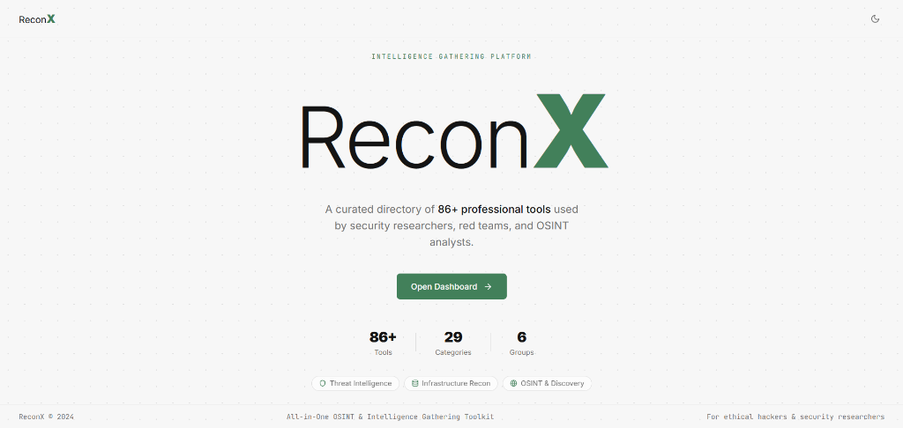
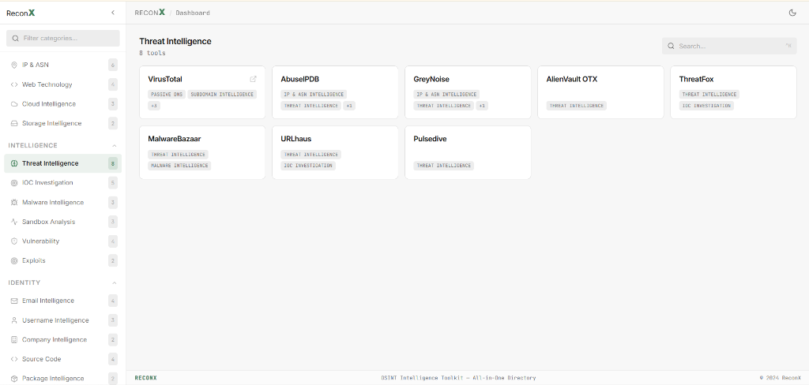

  
  <h1>ReconX</h1>
  
  
<b>Client-Side OSINT & Intelligence Gathering Toolkit</b>

  

    <a href="https://getreconx.vercel.app/"><b>getreconx.vercel.app</b></a>
  

   

ReconX is a centralized directory of over 80 professional tools used by security researchers, red teams, and OSINT analysts. The platform operates entirely client-side, offering a fast, distraction-free environment for intelligence gathering.

---

## Interface

  
   
  <em>ReconX Landing Page</em>

 

  
   
  <em>ReconX Dashboard & Tool Directory</em>

 

## Features in Action

  
   
  <em>Seamless Discovery & Target Mapping</em>

 

  
   
  <em>Live Threat Intelligence Dashboards</em>

 

  
   
  <em>Deep Infrastructure & Cloud Profiling</em>

 

## The Toolkit

ReconX centralizes **80+** of the most critical intelligence-gathering tools into six distinct workflows. Instead of jumping between bookmarks and search engines, analysts can access everything from a single, categorized dashboard.

### 1. Discovery
Tools focused on mapping the initial external footprint.
* **Search Intelligence:** Shodan, Censys, FOFA, Netlas, Criminal IP, ZoomEye.
* **Domain & DNS:** SecurityTrails, DNSDumpster, ViewDNS, MXToolbox.
* **Certificate Transparency:** crt.sh, SSLMate, Censys Certificates.
* **Subdomain Intelligence:** Chaos, RapidDNS, BufferOver.

### 2. Infrastructure
Tools for deep network and architectural profiling.
* **IP & ASN:** AbuseIPDB, GreyNoise, Hurricane Electric BGP, RIPEstat.
* **Web Technology:** Wappalyzer, BuiltWith, URLScan, Netcraft.
* **Cloud & Storage:** GrayHatWarfare, S3Scanner.

### 3. Intelligence
Tools for threat hunting, vulnerability mapping, and malware triage.
* **Threat & Malware:** VirusTotal, AlienVault OTX, ThreatFox, MalwareBazaar, URLhaus, Hybrid Analysis.
* **Sandbox Analysis:** ANY.RUN, Joe Sandbox, Triage.
* **Vulnerabilities & Exploits:** NVD, VulnCheck, CVE.org, Exploit-DB.

### 4. Identity
Tools for tracing humans, corporate entities, and source code.
* **Email & Username:** Hunter, Phonebook.cz, EmailRep, Have I Been Pwned, Sherlock, Maigret.
* **Company & Code:** OpenCorporates, Crunchbase, GitHub Search, Sourcegraph, Socket.dev, deps.dev.

### 5. Analysis
Tools for metadata, historical tracking, mapping, and the dark web.
* **Historical & Metadata:** Wayback Machine, Archive.today, ExifTool, FOCA.
* **Image & GEOINT:** Google Lens, TinEye, Google Earth, Sentinel Hub.
* **Mobile & Dark Web:** MobSF, APKMirror, Ahmia, Intelligence X.

### 6. Resources
Essential cheat sheets, frameworks, and offline processors.
* **References:** MITRE ATT&CK, ATT&CK Navigator, CyberChef, CVSS Calculator.

## Tech Stack

The application is built for maximum speed and privacy, with zero backend telemetry.

* **Next.js 15 (App Router):** Pre-rendered static site generation (SSG) for instant loading without a backend.
* **Tailwind CSS:** Custom UI with a professional, dark-themed design system (Inter & JetBrains Mono).
* **Zustand:** Lightweight client-side state management for the sidebar and UI preferences.
* **Lucide React:** Clean, consistent, and minimal iconography.
* **Vercel:** Deployed on the global edge network for immediate access.

## License

This project is licensed under the MIT License - see the [LICENSE](LICENSE) file for details.

Copyright © 2024 Sushen Kumar